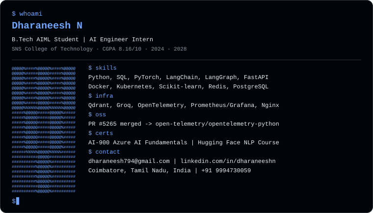

<div align="center">
  
</div>

<p align="center">
  <a href="https://readme-typing-svg.demolab.com">
    
  </a>
</p>


```python
from universe import engineer

class Dharaneesh(engineer):
    def __init__(self):
        self.name         = "Dharaneesh N"
        self.location     = "Coimbatore, India"
        self.degree       = "B.Tech in AI & ML"
        self.role         = "AI / ML Engineer"
        self.stack        = ["Python", "PyTorch", "LangChain",
                             "FastAPI", "Docker", "Kubernetes"]
        self.currently    = ["GraphRAG", "Distributed Systems",
                             "LLM Agent Orchestration"]
        self.fun_fact     = "I build agents that build other agents"
        self.superpower   = "Shipping production AI, not just notebooks"

    def connect(self) -> str:
        return "dharaneesh794@gmail.com"
```

<br clear="right"/>

## 🛠️ Tech Stack

### Languages


### AI/ML & LLMs


### Frameworks & Web


### Cloud & DevOps


### Databases


### Tools & Platforms


## 📊 GitHub Analytics

<div align="center">
  <a href="https://github.com/dharaneeshexe-web">
    
    
  </a>
</div>

<div align="center">
  <a href="https://streak-stats.demolab.com">
    
  </a>
</div>

<div align="center">
  <a href="https://github-readme-activity-graph.vercel.app">
    
  </a>
</div>

<div align="center">
  <a href="https://github-profile-trophy.vercel.app">
    
  </a>
</div>

### Contribution Snake
<div align="center">
  <picture>
    <source media="(prefers-color-scheme: dark)" srcset="https://raw.githubusercontent.com/dharaneeshexe-web/dharaneeshexe-web/output/github-contribution-grid-snake-dark.svg" />
    <source media="(prefers-color-scheme: light)" srcset="https://raw.githubusercontent.com/dharaneeshexe-web/dharaneeshexe-web/output/github-contribution-grid-snake.svg" />
    
  </picture>
</div>

<br>

## 🚀 Featured Projects

| Project | Stack | Highlights |
|---------|-------|------------|
| [MultiAgent Orchestrator](https://github.com/dharaneeshexe-web/multiagent-orchestrator) | LangGraph + FastAPI + Kubernetes | 5-agent DAG with hallucination scoring, parallel fan-out, automatic retry. 12-container K8s stack with Prometheus/Grafana, OpenTelemetry, CI/CD with rollback |
| [MedGraph RAG](https://github.com/dharaneeshexe-web/MEDGRAPH-TIGERGRAPH) | FAISS + TigerGraph + Groq LLaMA | FAISS RAG, GraphRAG & Hybrid QA. 2-hop retrieval with BERTScore. 5000+ vector embeddings for retrieval benchmarking |

## 🏆 Achievements

| | Achievement | Details |
|---|-------------|---------|
| 🏅 | TigerGraph x BuilderBase GraphRAG Hackathon | Participant (2026) |
| 🏅 | Scaler OpenEnv Hackathon | Participant (2025) |
| 🤗 | Hugging Face Spaces | Deployed AI/RL applications |
| 🌍 | Open Source | Merged [PR #5265](https://github.com/open-telemetry/opentelemetry-python/pull/5265) into [open-telemetry/opentelemetry-python](https://github.com/open-telemetry/opentelemetry-python) |

## 🎓 Education

| Degree | Institution | Year | Score |
|--------|-------------|------|-------|
| B.Tech – Artificial Intelligence & Machine Learning | SNS College of Technology, Coimbatore | 2024 – Present | CGPA 8.16 |

### Currently Learning
```text
🧠 GraphRAG       → TigerGraph + FAISS Hybrid Retrieval
⚙️ Distributed Systems → Kubernetes + Kafka + Celery
🤖 LLM Agents     → LangGraph + Multi-Agent Orchestration
```

### Dev Quote
<div align="center">
  
</div>

<br>

## 📫 Let's Connect

<p align="center">
  <a href="mailto:dharaneesh794@gmail.com"></a>
  <a href="https://linkedin.com/in/dharaneeshn"></a>
  <a href="https://huggingface.co/dharaneesh1212"></a>
  <a href="https://github.com/dharaneeshexe-web"></a>
</p>

<p align="center">
  
</p>


---

## Dharaneesh's Community Chess Tournament

**Game is in progress.** This is open to ANYONE to play the next move. That's the point. :wave:  It's your turn! Move a white (hollow) piece.

|   | A | B | C | D | E | F | G | H |
| - | - | - | - | - | - | - | - | - |
| 8 |  |  |  |  |  |  |  |  |
| 7 |  |  |  |  |  |  |  |  |
| 6 |  |  |  |  |  |  |  |  |
| 5 |  |  |  |  |  |  |  |  |
| 4 |  |  |  |  |  |  |  |  |
| 3 |  |  |  |  |  |  |  |  |
| 2 |  |  |  |  |  |  |  |  |
| 1 |  |  |  |  |  |  |  |  |

#### **WHITE (hollow):** It's your move... to choose _where_ to move...

| FROM | TO - _just click one of the links_ :) |
| ---- | -- |
| **A2** | [A3](https://github.com/dharaneeshexe-web/dharaneeshexe-web/issues/new?title=chess%7Cmove%7Ca2a3%7C1&body=Just+push+%27Submit+new+issue%27.+You+don%27t+need+to+do+anything+else.) , [A4](https://github.com/dharaneeshexe-web/dharaneeshexe-web/issues/new?title=chess%7Cmove%7Ca2a4%7C1&body=Just+push+%27Submit+new+issue%27.+You+don%27t+need+to+do+anything+else.) |
| **B2** | [B3](https://github.com/dharaneeshexe-web/dharaneeshexe-web/issues/new?title=chess%7Cmove%7Cb2b3%7C1&body=Just+push+%27Submit+new+issue%27.+You+don%27t+need+to+do+anything+else.) , [B4](https://github.com/dharaneeshexe-web/dharaneeshexe-web/issues/new?title=chess%7Cmove%7Cb2b4%7C1&body=Just+push+%27Submit+new+issue%27.+You+don%27t+need+to+do+anything+else.) |
| **C2** | [C3](https://github.com/dharaneeshexe-web/dharaneeshexe-web/issues/new?title=chess%7Cmove%7Cc2c3%7C1&body=Just+push+%27Submit+new+issue%27.+You+don%27t+need+to+do+anything+else.) , [C4](https://github.com/dharaneeshexe-web/dharaneeshexe-web/issues/new?title=chess%7Cmove%7Cc2c4%7C1&body=Just+push+%27Submit+new+issue%27.+You+don%27t+need+to+do+anything+else.) |
| **D2** | [D3](https://github.com/dharaneeshexe-web/dharaneeshexe-web/issues/new?title=chess%7Cmove%7Cd2d3%7C1&body=Just+push+%27Submit+new+issue%27.+You+don%27t+need+to+do+anything+else.) , [D4](https://github.com/dharaneeshexe-web/dharaneeshexe-web/issues/new?title=chess%7Cmove%7Cd2d4%7C1&body=Just+push+%27Submit+new+issue%27.+You+don%27t+need+to+do+anything+else.) |
| **E2** | [E3](https://github.com/dharaneeshexe-web/dharaneeshexe-web/issues/new?title=chess%7Cmove%7Ce2e3%7C1&body=Just+push+%27Submit+new+issue%27.+You+don%27t+need+to+do+anything+else.) , [E4](https://github.com/dharaneeshexe-web/dharaneeshexe-web/issues/new?title=chess%7Cmove%7Ce2e4%7C1&body=Just+push+%27Submit+new+issue%27.+You+don%27t+need+to+do+anything+else.) |
| **F2** | [F3](https://github.com/dharaneeshexe-web/dharaneeshexe-web/issues/new?title=chess%7Cmove%7Cf2f3%7C1&body=Just+push+%27Submit+new+issue%27.+You+don%27t+need+to+do+anything+else.) , [F4](https://github.com/dharaneeshexe-web/dharaneeshexe-web/issues/new?title=chess%7Cmove%7Cf2f4%7C1&body=Just+push+%27Submit+new+issue%27.+You+don%27t+need+to+do+anything+else.) |
| **G2** | [G3](https://github.com/dharaneeshexe-web/dharaneeshexe-web/issues/new?title=chess%7Cmove%7Cg2g3%7C1&body=Just+push+%27Submit+new+issue%27.+You+don%27t+need+to+do+anything+else.) , [G4](https://github.com/dharaneeshexe-web/dharaneeshexe-web/issues/new?title=chess%7Cmove%7Cg2g4%7C1&body=Just+push+%27Submit+new+issue%27.+You+don%27t+need+to+do+anything+else.) |
| **H2** | [H3](https://github.com/dharaneeshexe-web/dharaneeshexe-web/issues/new?title=chess%7Cmove%7Ch2h3%7C1&body=Just+push+%27Submit+new+issue%27.+You+don%27t+need+to+do+anything+else.) , [H4](https://github.com/dharaneeshexe-web/dharaneeshexe-web/issues/new?title=chess%7Cmove%7Ch2h4%7C1&body=Just+push+%27Submit+new+issue%27.+You+don%27t+need+to+do+anything+else.) |
| **B1** | [A3](https://github.com/dharaneeshexe-web/dharaneeshexe-web/issues/new?title=chess%7Cmove%7Cb1A3%7C1&body=Just+push+%27Submit+new+issue%27.+You+don%27t+need+to+do+anything+else.) , [C3](https://github.com/dharaneeshexe-web/dharaneeshexe-web/issues/new?title=chess%7Cmove%7Cb1C3%7C1&body=Just+push+%27Submit+new+issue%27.+You+don%27t+need+to+do+anything+else.) |
| **G1** | [F3](https://github.com/dharaneeshexe-web/dharaneeshexe-web/issues/new?title=chess%7Cmove%7Cg1F3%7C1&body=Just+push+%27Submit+new+issue%27.+You+don%27t+need+to+do+anything+else.) , [H3](https://github.com/dharaneeshexe-web/dharaneeshexe-web/issues/new?title=chess%7Cmove%7Cg1H3%7C1&body=Just+push+%27Submit+new+issue%27.+You+don%27t+need+to+do+anything+else.) |

Ask a friend to take the next move: [Share on Twitter...](https://twitter.com/share?text=I%27m+playing+chess+on+a+GitHub+Profile+Readme!+Can+you+please+take+the+next+move+at+https%3A%2F%2Fgithub.com%2Fdharaneeshexe-web)

**How this works**

When you click a link, it opens a GitHub Issue with the required pre-populated text. Just push "Create New Issue". That will trigger a [GitHub Actions](https://github.blog/2020-07-03-github-action-hero-casey-lee/#getting-started-with-github-actions) workflow that'll update my GitHub Profile _README.md_ with the new state of the board.

**Notice a problem?**

Raise an [issue](https://github.com/dharaneeshexe-web/dharaneeshexe-web/issues), and include the text _cc @dharaneeshexe-web_.

**Last few moves, this game**

| Move  | Who |
| ----- | --- |
| _New game_ | _No moves yet._ |

**Top 20 Leaderboard: Most moves across all games, except me.**

| Moves | Who |
| ----- | --- |
| _No moves yet._ | _Be the first!_ |


